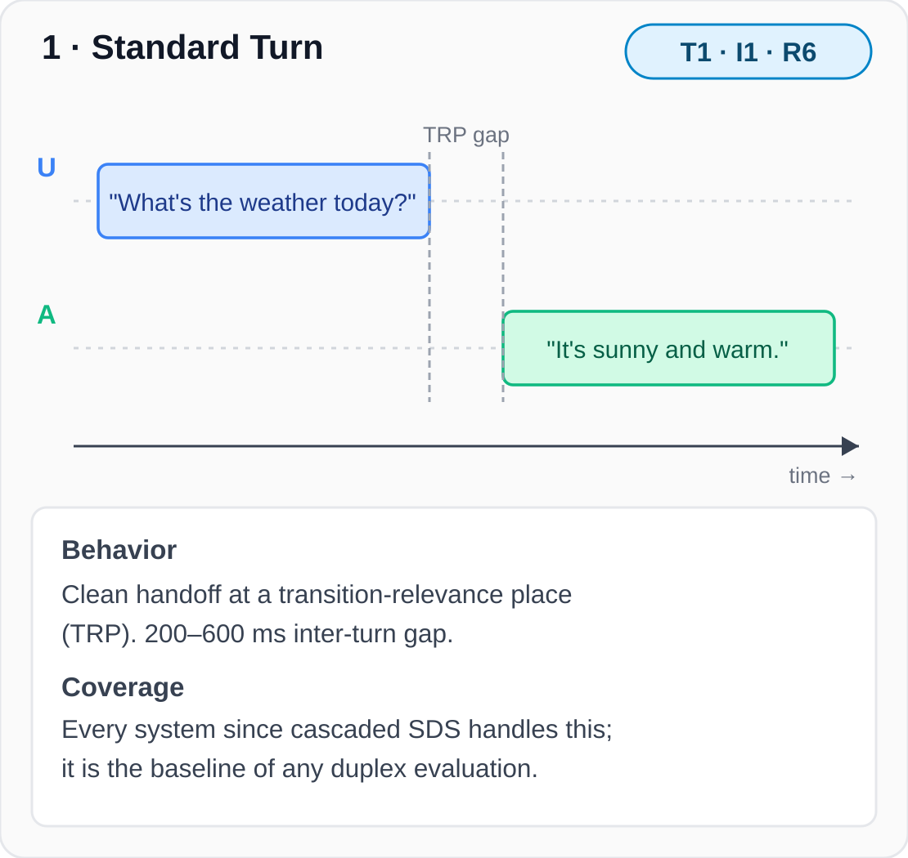
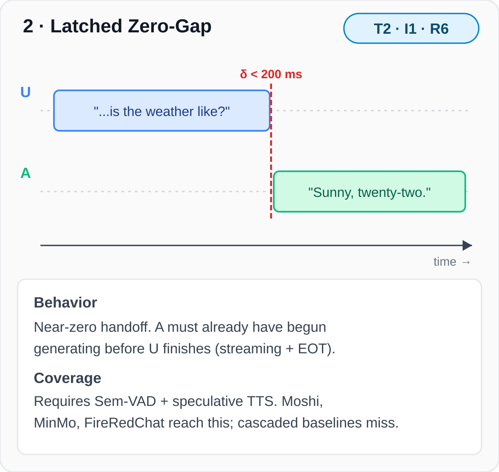
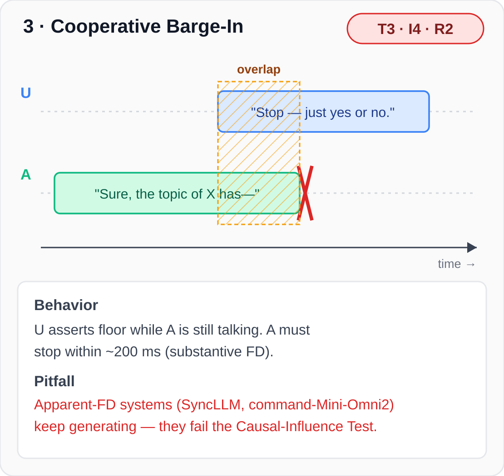
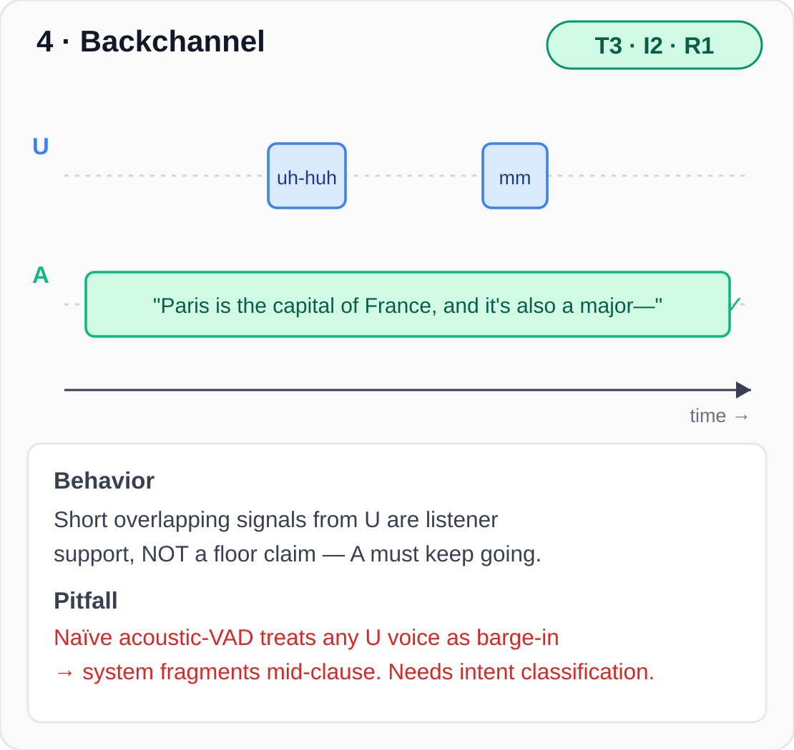
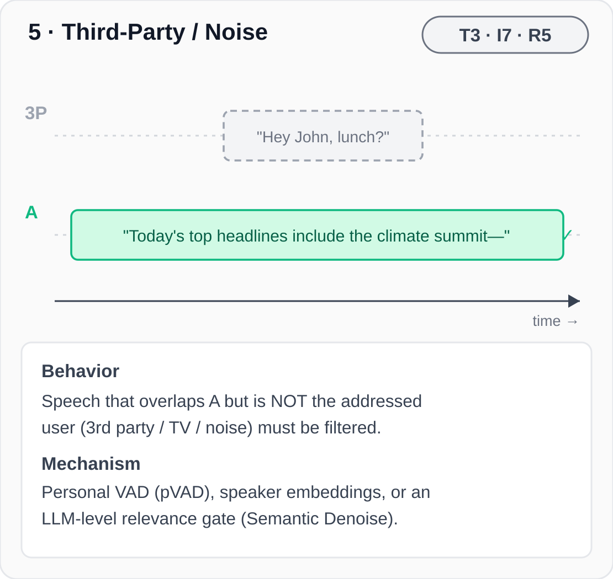
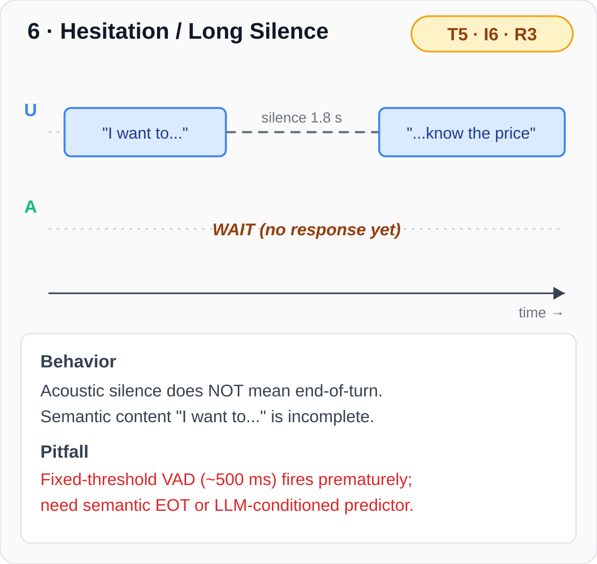

<h2 align="center">Six Canonical Full-Duplex Scenarios — Demo</h2>

  <a href="https://duplexlm.github.io/DuplexLM/demo.html"><b>🔗 Open the interactive demo →</b></a>
  &nbsp;·&nbsp;
  Synced dual-channel waveform · cursor follows audio · click to seek

  <b>Channels</b> — Left = User / Third-Party · Right = Assistant. 
  The 6 canonical T·I·R scenarios are diagrammed below. <b>Full interactive playback is on the demo page above.</b>

<table align="center">
<tr>
<td width="33%" align="center" valign="top">
  <h3>1 · Standard Turn &nbsp;<code>T1·I1·R6</code></h3>
  
  
<em>U asks → 600 ms TRP gap → A replies (standard turn)</em>

</td>
<td width="33%" align="center" valign="top">
  <h3>2 · Latched Zero-Gap &nbsp;<code>T2·I1·R6</code></h3>
  
  
<em>U asks → ~300 ms natural turn-taking → A replies</em>

</td>
<td width="33%" align="center" valign="top">
  <h3>3 · Cooperative Barge-In &nbsp;<code>T3·I4·R2</code></h3>
  
  
<em>4.09 s — U interrupts; 500 ms overlap; A stops</em>

</td>
</tr>
<tr>
<td width="33%" align="center" valign="top">
  <h3>4 · Backchannel &nbsp;<code>T3·I2·R1</code></h3>
  
  
<em>6.00 s — U &ldquo;Uh-huh&rdquo; &amp; &ldquo;Mm&rdquo;; A continues</em>

</td>
<td width="33%" align="center" valign="top">
  <h3>5 · Third-Party / Noise &nbsp;<code>T3·I7·R5</code></h3>
  
  
<em>3.28 s — 3rd-party speaks (L); A ignores</em>

</td>
<td width="33%" align="center" valign="top">
  <h3>6 · Hesitation / Long Silence &nbsp;<code>T5·I6·R3</code></h3>
  
  
<em>4.10 s — 1.8 s mid-utterance silence; A silent</em>

</td>
</tr>
</table>

  <a href="https://duplexlm.github.io/DuplexLM/demo.html"><b>▶ Open interactive demo</b></a>
  to hear all six with synchronized waveform cursors.

